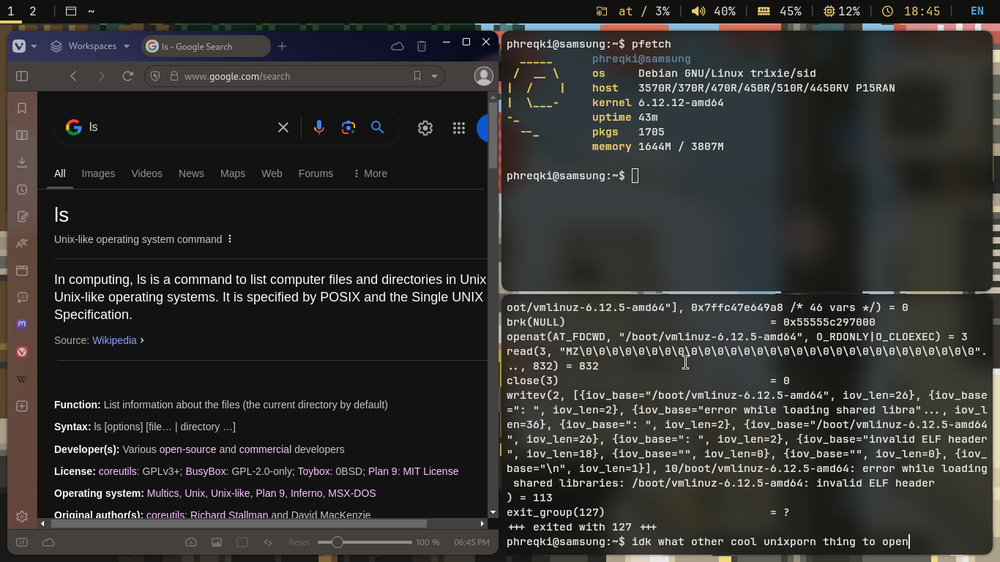

<h1 style="font-size: 15px; text-align: center" align="center">
<samp>
<pre>
                  __ _ _____ 
  ___ ___  _ __  / _(_)___ / 
 / __/ _ \| '_ \| |_| | |_ \ 
| (_| (_) | | | |  _| |___) |
 \___\___/|_| |_|_| |_|____/ 
<span></span>
Okay looking dotfiles for i3
</pre>
</samp>
</h1>
These are the dotfiles that I personally use in my i3 + picom setup. It's very slightly modified from the default presets of these programs.

<br>
<br>

<div style="display: flex; justify-content: center;">

</div>

## What does this incude and development
These dotfiles are very simple and are just modifications from the sample configuration files provided by the programs used in this.

And as for the "development" part, I cannot find the right word for this since managing dotfiles aren't really development but no one is going to see this either way.

All commits will have these prefixes before the commit message. From the top and bottom represent the importance of these as shown:
```
    ^   (addition)
    |   (cosmetic)
    |   (readme)
    v   (chore)
   --
     `__ down
```

## Key bindings
This uses your keyboard's Win key as the `$mod` key. Most of the original key bindings from i3 are left unchanged. 
However, to change the wallpaper and colors, press `$mod+Shift+M` to change the wallpaper, and the color scheme additionally.

## Prerequisites
```
kitty
mate-terminal
picom
polybar
rofi
xwallpaper (to use feh soon)
zenity

fonts-cascadia-code && CaskaydiaMono NF*
```
> CaskaydiaMono NF can be installed from the Nerd Fonts website.

## Installation
Clone this repository, and run `make`.

The `make`file provides two post-install targets that you can run.
- `disable-blur` disables blur of all translucent elements.
- `disable-kitty-opacity` disables opacity from `kitty`.

## Bugs, TODOs and Contributing
This configuration is still in WIP and if you face any problems, but know how to fix it, you should make an issue or a PR with your fix.

### Known bugs:
- No wallpaper by default, user has to press key binding to set it.
- Polybar looks broken upon first login.
- ~`./wal.sh` cannot set the color scheme from `$mod+Shift+M` invokation. This likely has something to do with it having to invoke it through bash instead of the shebang. (idk)~ It can.

### TODO:
- Make the configuration remember your wallpaper
    - Note: The logic behind this was implemented but doesn't work, yet.
- Add a keybinding for screenshotting
- [x] Make Polybar look less bland
- Use `feh` instead of `xwallpaper`

## License
MIT License.
